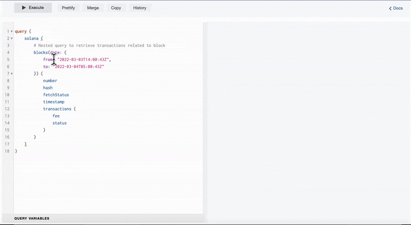

Using SolanaFM, you can dive deeper into the Solana blockchain by navigating through these nested queries. Models are joined via a hash and timestamp



## Account Input 

Elements of account inputs are inner joined with other tables either via a "from" and "to" timestamp 
1. transaction_hash
2. account_hash 

### Tables that inner joins with Account Input 
1. account-instruction
  - Joined via account_hash & timestamp 
2. account-transaction 
- Joined via account_hash & timestamp 
3. transaction
- Joined via transaction_hash & timestamp 
4. transaction-signature
- Joined via transaction_hash & timestamp 
5. transaction-log 
- Joined via transaction_hash & timestamp 
6. transaction-instruction 
- Joined via transaction_hash & timestamp 

#### Example 
```
query {
    solana {
       accountInputs {
         transactionHash
         account
         tokenId
         preBalance
         postBalance
         timestamp
        accountTransactions {
          transactionHash
          account
          role
          timestamp
        }
       }
    }
}
```


#### Result 
```
xxx
```